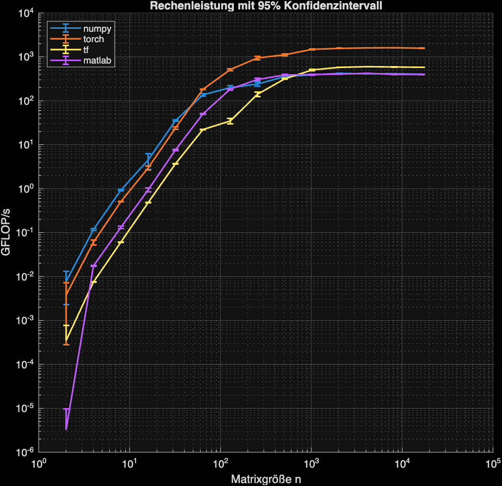
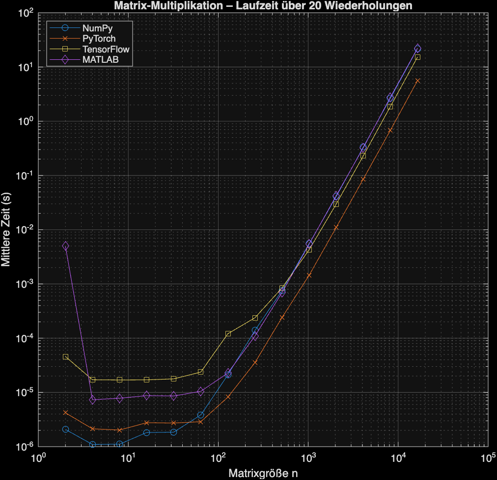

# MatrixMultiplicationSpeedComparison.git
A small Test written to compare the speed of Numpy, PyTorch, Tensorflow and MATLAB.

## How to use
1. (In Bash) 
``` bash
pip install -r requirements.txt
```

2. (In Matlab)
``` matlab
pyenv('Version', '/path/to/your/python');
```

3. Install Machine Learning and Statistics Toolbox for Matlab. Otherwise only Python wll run through

4. (In Matlab)
```matlab
>> run_and_compare
```

## Results
The results in this repo come from an M1 Pro with 8 CPU Cores and 16 GB RAM.
As one can clearly see the Usage of the Accelerate Framework in PyTorch makes it unbeatable.



